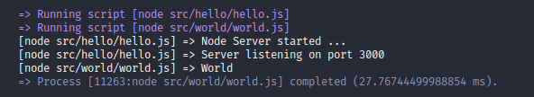

# Gazeall - Run command on folder and file changes


[](https://greenkeeper.io/)

This project was developed using TypeScript with the help of [TSCLI](https://www.npmjs.com/package/tscli)

## Watch file for changes and run things


__Gazeall__ watches files and folders for changes, then leaps to action and executes one of more commands.

__Gazeall__ works both as a CLI tool and equally well running NPM scripts from "__package.json__".

NPM scripts can be run in parallel or synchronous mode.

## Install

```sh
npm install gazeall
```

## Usage

```sh
$ gazeall -h
Usage: gazeall [options] [files...]

Options:
  -v, --version           output the version number
  -r, --run <command...>  run commands then wait for changes to re-run
  -w, --watch <files...>  files to watch for change
  -W, --wait              enter wait, commands will run on changes
  -p, --npmp <scripts>    NPM scripts to run parallel
  -s, --npms <scripts>    NPM scripts to run synchronous
  -d, --delay <ms>        start delay value in milliseconds
  -H, --halt              halt on error
  -V, --verbose           verbose logging
  -h, --help              display help for command

```

## Improved execution output

Default logging, with command.



Verbose logging, with process id, command, watch files.


Logging with prefix, "=>" is what gazeall is doing.
Logging in white, is output from executed command, process, or NPM script.

Output now shows the following:

1. Commands being executed
1. Files being watched when verbose mode enables (see options above).
1. Process output with process id and command shown in square brackets.
1. Process output after the "=>" arrow.
1. Process execution time.

Improved output is more useful when multiple processes are executing.

## CLI Examples

The examples below show various ways to run __gazeall__ from the command line.

1. Make sure to place commands inside quotes if options are passed or there are multiple commands.
1. When using globs to recuse into sub-folders, make sure to put them inside quotes.

### Run programs and commands using the CLI

To run a JavaScript file using Node.js and have gazeall monitor all JavaScript file for changes in the current folder and all sub-folders, type the following.

```sh
npx gazeall main.js
```

The above syntax is just shorthand for:

```sh
npx gazeall --run "node main.js" --watch "**/*.js"
```

The following shorthand will run a JavaScript file using Node:

```sh
npx gazeall main.js src bin
```

is equivalent to:

```sh
npx gazeall --run "node main.js" --watch "src/*" "bin/*"
```

### Watch all files and sub-folders

Watch all files under "__src__" folder.

```sh
npx gazeall --run  <command> "src/*"
```

__NOTE__: For file globs, always put then inside quotes.

Watch all files under "__src__" folder and sub-folders.

```sh
npx gazeall --run <command> "src/**/*"
```

Watch all files under multiple folders recursively.

__NOTE__: Files are space separated and quoted and always appear last.


### Watch all files under multiple sub-folders

This will run the command and then start to watch files for changes under sub-folder "__src__" and "__libs__".

```sh
npx gazeall --run <command> "folder1/**/*" "folder2/**/*"

npx gazeall --run "node src/main.js" --watch "src/**/*" "libs/**/*"
```

### Omitting watch folders and files

This shorthand will watch all files under all sub-folders "**/*".

```sh
npx gazeall --run "node src/main.js"
```

Expands to:

```sh
npx gazeall --run "node src/main.js" --watch "**/*"
```

#### Watch option

The watch flag is optional. Should you get confused about usage, it may be added to improve clarity.

```sh
npx gazeall -r <command> -w "src/**/*" "test/**/*"

npx gazeall --run <command> --watch "src/**/*" "test/**/*"
```

### Run a program using Node.js from a NPM script

If your project has a "__package.json__" file, and gazeall is run without any arguments. It will look for the property in "__main__" and run the file using Node. If the "__main__" property is missing gazeall will exist with an error message.

```json
// File: package.json
{
  ...
  "main": "server.js",
  "scripts": {
    "start": "gazeall"
  },
  ...
}
```

The same execution logic will be used if you also type, "__npx gazeall__" in the Terminal from the root folder of the project.

So typing just "__npx gazeall__" from the root of the Node project would be similar to:

```sh
npx gazeall --run "node server.js --watch "**/*.js"
```

### Delay running a command

To delay running a command, make use of the "__--delay \<milliseconds\>__" flag.
This will delay the execution of the command by 5 seconds.

```sh
npx gazeall --run "node src/main.js" --delay 5000
```

### Wait first and run command on change

Gazeall executes the command immediately. However you can tell it to wait for changes before executing the command.

Below command is only executed after changes are detected when the "__--wait__" flag is used.

```sh
npx gazeall --wait --run "node src/main.js"
```

### Target specific files to watch

Files are separated by a space.

```sh
npx gazeall --run "node src/main.js" --watch index.html src/main.js
```

### Running multiple commands

Multiple commands can be executed. Each command and its arguments must be surrounded with quotes.

```sh
npx gazeall --run "tsc src/*.ts" "node build/main.js" --watch "src/*" "build/*"
```

## NPM script examples

For running NPM scripts inside package.json, __gazeall__ can run NPM scripts either in __parallel__ or __synchronous__.

* To run in parallel mode, use: "__--npmp__".
* To run in synchronous mode, use: "__--npms__".

__NOTE__: You may also use the "__--wait__" switch when running NPM scripts.

The syntax format is:

```js
gazeall --npmp "scripts..." "watch folders and files"
gazeall --npms "scripts..." "watch folders and files"
```

### Run NPM scripts in sequence

In sequence mode, __gazeall__ will wait for the running command to complete before running the next command.

Here three NPM scripts are run in sequence (build->webinit->webrefresh). The next NPM script is run only after the current NPM script completes.

```js
  "scripts": {
    "webwatch": "gazeall --npms 'build webinit webrefresh' 'src/**/*'"
  }
```

__NOTE__: You can used single quotes inside the double quotes for grouping. This was you won't have to escape double quotes.

This NPM script "build", runs and __gazeall__ watches two folders and their sub-folders.

```js
  "scripts": {
    "build": "gazeall --npms build 'src/**/*' 'vendor/**/*'"
  }
```

### Run NPM scripts in parallel

In gazeall parallel mode, all NPM scripts execute one after the other without waiting.

```js
  "scripts": {
    "build": "gazeall --npmp 'run:dev run:test' 'src/**/*'"
  }
```

__gazeall__ runs NPM scripts and watches two folders and their sub-folders.

```js
  "scripts": {
    "build": "gazeall --npmp 'run:dev run:test' 'src/**/*' 'test/**/*'"
  }
```

__NOTE__: We make use of double quote and need to escape them, this is the best practice as single quotes can have problem when used on Windows.
